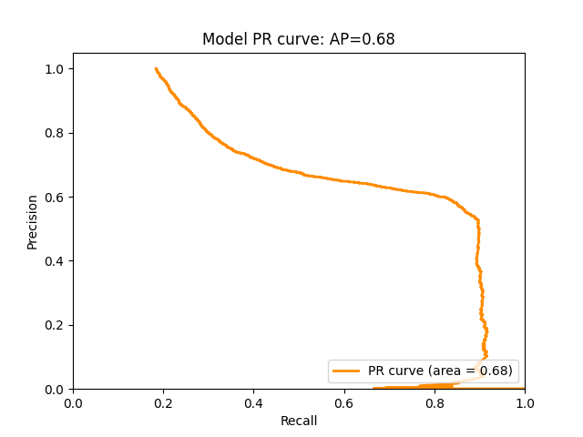

# 🚀 Fraud Detection in Financial Transactions using Graph Neural Networks 🚀

In this project, I demonstrate the tremendous potential of Graph Neural Networks (GNNs) 🔀 for detecting fraudulent transactions 💳💰. I harness the power of Amazon SageMaker 🧪 for model training and hyper-parameter optimization and leverage the Deep Graph Library (DGL) to work with intricate graph data structures and train a Relational Graph Convolutional Networks (Relational-GCN) model. 💡

## 🔬 Understanding Graph Neural Networks (GNNs)

GNNs are an exciting class of neural networks designed to perform prediction tasks on graph data structures 🌐. These neural networks have gained significant popularity due to their proficiency in exploiting the rich relational information embedded in the graph structure. When it comes to fraud detection, this network capably learns complex patterns within the transaction data and can identify anomalies indicating fraudulent transactions. 🎯

## 📚 Introduction to Relational Graph Convolutional Networks (R-GCN)

The R-GCN model is a specialized variant of GNNs, fine-tuned for dealing with multi-relational data. Unlike conventional GNNs, R-GCN can handle heterogeneous graphs containing different types of nodes and edges, each symbolizing various relationships. This capability makes it an excellent tool for detecting patterns in complex datasets like financial transactions. 👍

## 📂 Input Data and its Significance

This project uses synthetic datasets that mirror the intricate patterns found in real-world financial transactions. These datasets include:

1. **Transactions dataset**: This dataset logs transactions and associated metadata, such as the product code, details about the card used, and an indication of whether the transaction was fraudulent. 💼

2. **Identity dataset**: This dataset provides identity information about the users involved in the transactions, capturing attributes like the device type and device IDs used for the transaction. 👥

These datasets are fused using a unique identifier, `TransactionID`. The consolidated dataset consists of identity, categorical, and numerical columns that collectively capture the essence of each transaction, and a target column `isFraud` that flags fraudulent transactions. 🎯

## 🔮 Predictive Outputs

Upon successful model training, the project produces:

1. A trained R-GCN model based on the synthetic datasets. 💽
2. A benchmark SageMaker XGBoost model trained on the same datasets for comparison. 📈
3. Predictions of the likelihood of each transaction being fraudulent. If the estimated probability exceeds a certain threshold, the transaction is flagged as fraudulent. 🚩

## 🧠 Why Rely on Graph Neural Networks (GNNs)?

Financial transaction data is inherently relational, containing various features and identity markers that can be used to understand the relationship between different transactions. This relational information can be effectively harnessed using GNNs to construct heterogeneous graphs. 

In these graphs, different nodes and edges represent unique types of attributes. The GNN then leverages this graph structure to learn a hidden representation (embedding) for each transaction, enabling effective classification of whether a transaction is fraudulent. 📊

Here's an illustration of a heterogeneous graph created for this project:

## 💾 Implementing the R-GCN Model

In this project, I have utilized the R-GCN model, a state-of-the-art GNN model suitable for heterogeneous graph input. Additionally, the SageMaker XGBoost model is used as a baseline for comparison. 🏁

## 🔄 Process Overview

The solution unfolds in three primary stages:

1. **Data preparation and feature engineering**: Here, I leverage Amazon SageMaker Processing for feature engineering and extraction of edge lists from the transaction and identity datasets. 🔧
2. **Baseline model training**: I train the SageMaker XGBoost model with Hyper-Parameter Optimization (HPO) as a comparative benchmark. 🧪
3. **R-GCN model training**: Utilizing Amazon SageMaker's training infrastructure, I train an R-GCN with Hyper-Parameter Optimization (HPO). The R-GCN model, after training, has demonstrated better predictive performance than the baseline XGBoost model on test data. 🏆

Here's the PR curve and ROC curve illustrating the model's performance:

## 📖 Project Usage

If you wish to replicate this project:

1. Clone the repository. 🔄
2. Open the `dgl-fraud-detection.ipynb` notebook. 📓
3. Follow the steps in the notebook to train the model and run the hyper-parameter optimization. 👩‍💻

## 🛠 Requirements

This project requires:

- Python 3 (Data Science) kernel 🐍
- Amazon SageMaker 🧪
- Deep Graph Library (DGL) 🔀
- XGBoost 📈
- Boto3 🤖
- AWS Service Catalog 📋

## 💾 Dataset

The project employs a synthetic dataset that is stored in an S3 bucket. You can substitute this dataset with your own by updating the `raw_data_location` variable in the notebook. 🔄
